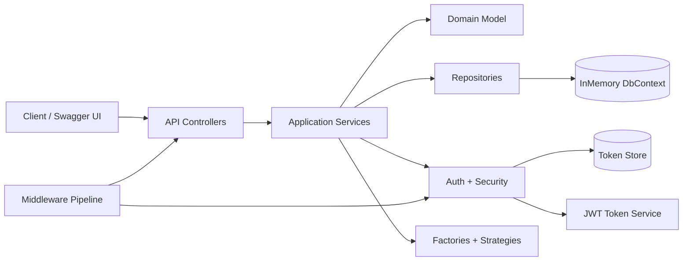
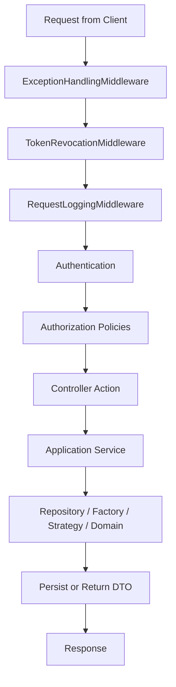
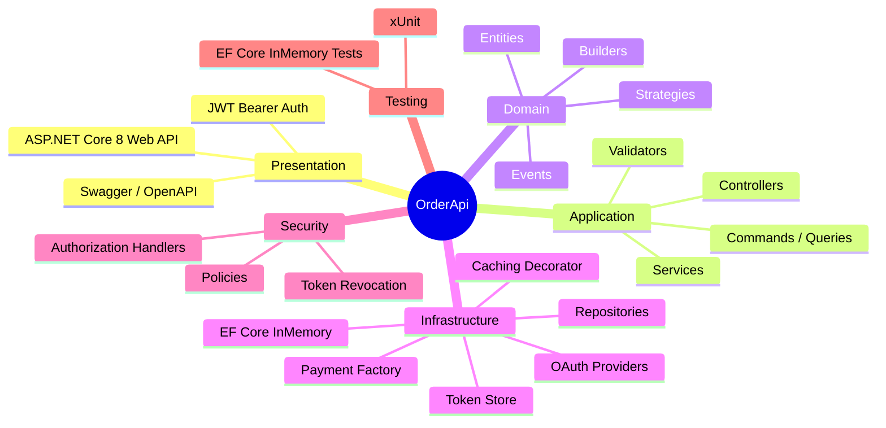

# OrderApi

OrderApi is a portfolio-style ASP.NET Core 8 Web API that demonstrates the five SOLID principles, ten design patterns, JWT/OAuth authentication, authorization policies, and a clean layered architecture around an order management domain.

## Local Setup & Run

### Prerequisites

- .NET 8 SDK installed locally
- A terminal with access to the repository root

### Setup Steps

1. Clone the repository and open the root folder.
2. Navigate to the API project:

       ```bash
       cd "Design Patterns/OrderApi"
       ```

3. Restore dependencies:

       ```bash
       dotnet restore
       ```

4. Build the application:

       ```bash
       dotnet build
       ```

5. Run the API:

       ```bash
       dotnet run
       ```

6. Open Swagger in your browser:

       ```text
       https://localhost:5001/swagger
       ```

### Optional Test Run

If you want to verify the sample tests as well, run the test project from the repository root:

```bash
dotnet test "Design Patterns/OrderApi.Tests/OrderApi.Tests.csproj"
```

## Quick Start

1. Open the solution folder at `Design Patterns/OrderApi`.
2. Run the API with `dotnet run`.
3. Open Swagger at `/swagger`.
4. Use the seeded admin credentials:
   - Email: `admin@orderapi.com`
   - Password: `Admin123!`
5. Click **Authorize** in Swagger and paste `Bearer {your_token}`.

## Seeded Data

- Admin user: `admin@orderapi.com` / `Admin123!`
- Customer user: `customer@orderapi.com` / `Customer123!`
- One customer profile linked to the customer user
- Two sample customer orders for immediate API exploration

## Pattern Index

| Type | Pattern / Principle | Where It Appears | Why It Matters |
| --- | --- | --- | --- |
| SOLID | Single Responsibility | Services, middleware, validators, token services | Each class has one reason to change |
| SOLID | Open/Closed | Discount strategies, OAuth providers | Add new behavior without modifying existing orchestration |
| SOLID | Liskov Substitution | Payment processors, OAuth providers, token services | Concrete types remain substitutable through their interfaces |
| SOLID | Interface Segregation | Split read/write repositories, token store interfaces | Consumers depend only on what they actually use |
| SOLID | Dependency Inversion | Controllers/services depend on abstractions | Infrastructure details stay behind interfaces |
| Pattern | Strategy | Discount strategies | Swap discount algorithms at runtime |
| Pattern | Factory | PaymentProcessorFactory, OAuthProviderFactory | Create concrete implementations from a name |
| Pattern | Repository | AppDbContext repositories | Hide persistence behind domain-friendly abstractions |
| Pattern | Decorator | CachedOrderRepository | Add caching without changing the core repository |
| Pattern | Builder | OrderBuilder, JwtClaimsBuilder | Build complex objects fluently and clearly |
| Pattern | Observer | Domain events and event handlers | Side-effects react to domain events independently |
| Pattern | Chain of Responsibility | Middleware pipeline | Each middleware handles one concern and passes control onward |
| Pattern | CQRS | Commands and queries | Keep write operations and read operations separate |
| Pattern | Template Method | OAuthProviderBase | Fix the flow while allowing provider-specific steps |
| Pattern | Proxy | JwtTokenValidatorProxy | Cache validated principals behind a token validation facade |

## Architecture Summary

- **Controllers** stay thin and delegate to services.
- **Application services** orchestrate business rules and coordinate repositories, factories, strategies, and authorization.
- **Domain** contains entities, events, enums, and strategies.
- **Infrastructure** holds persistence, auth, factories, and decorators.
- **Security** contains custom authorization requirements and handlers.
- **Middleware** manages exception handling, logging, and token revocation.

## Endpoints

### Auth
- `POST /api/auth/login`
- `POST /api/auth/refresh`
- `POST /api/auth/logout`
- `GET /api/auth/oauth/{provider}`
- `GET /api/auth/oauth/{provider}/callback`

### Orders
- `POST /api/orders`
- `GET /api/orders`
- `GET /api/orders/my`
- `GET /api/orders/{id}`
- `DELETE /api/orders/{id}/cancel`

## Authentication Flow Diagrams

### Local Login Flow

```text
Client → POST /auth/login → AuthService → UserRepository → JwtTokenService → JwtClaimsBuilder
       ← TokenResponse ←─────────────────────────────────────────────────────────────────────
```

### OAuth Flow

```text
Client → GET /auth/oauth/google → OAuthProviderFactory → GoogleOAuthProvider → AuthorizationUrl
Client → GET /auth/oauth/google/callback?code=X → ExchangeCodeForToken → GetUserInfo
       → UserRepository (upsert) → JwtTokenService → TokenResponse
```

### Token Revocation Flow

```text
Client → POST /auth/logout → blacklist JTI → TokenRevocationMiddleware blocks future requests
```

## Architecture Diagrams

### 1. System Architecture



### 2. Request Workflow



### 3. Tech Stack Overview



## Notes

- OAuth credentials are placeholders, but the provider classes still make real HTTP requests when valid credentials are supplied.
- The app uses in-memory persistence for a zero-setup demo experience.
- The repository includes a dedicated xUnit test project for controller, service, repository, and security tests.
